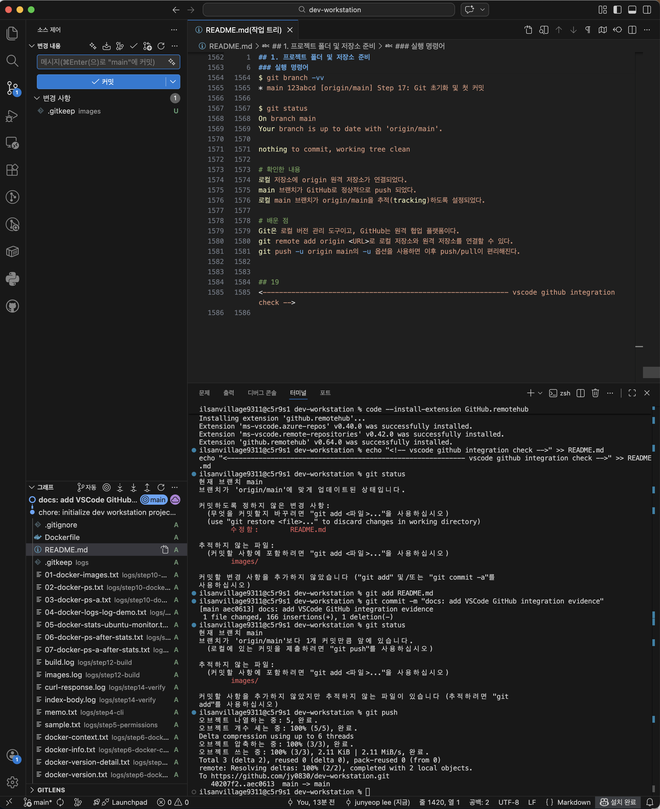

## 1. 프로젝트 폴더 및 저장소 준비

### 목적
로컬 프로젝트 폴더를 만들고 Git 저장소를 초기화한 뒤 기본 브랜치를 main으로 설정한다.

### 실행 명령어

mkdir -p ~/dev-workstation
cd ~/dev-workstation
git init
git config user.name "홍길동"
git config user.email "hong@example.com"
git branch -M main
git status

### 출력 결과
On branch main
No commits yet
nothing to commit (create/copy files and use "git add" to track)


## 2. 기본 파일 구조 생성
### 목적
Docker 실습과 문서 기록을 위한 기본 프로젝트 구조를 생성한다.

### 실행 명령어

cd ~/dev-workstation
mkdir -p site images logs
touch README.md Dockerfile .gitignore site/index.html
touch images/.gitkeep logs/.gitkeep
ls -la
ls -la site
ls -la images
ls -la logs
git status

### 출력 결과
$ ls -la
total ...
drwxr-xr-x ...
drwxr-xr-x ... .git
-rw-r--r-- ... .gitignore
-rw-r--r-- ... Dockerfile
-rw-r--r-- ... README.md
drwxr-xr-x ... images
drwxr-xr-x ... logs
drwxr-xr-x ... site

$ ls -la site
total ...
-rw-r--r--


## 3. 실행 환경 확인
### 목적
개발 워크스테이션 구축에 필요한 기본 실행 환경이 정상적으로 준비되어 있는지 확인한다.  
운영체제, 셸, 터미널, Docker, Git의 설치 및 동작 여부를 점검한다.

### 실행 명령어

uname -a
echo $SHELL
echo $TERM
docker --version
git --version

### 출력 결과
$ uname -a
Darwin c5r9s1.codyssey.kr 24.6.0 Darwin Kernel Version 24.6.0: Mon Jan 19 22:00:10 PST 2026; root:xnu-11417.140.69.708.3~1/RELEASE_X86_64 x86_64

$ echo $SHELL
/bin/zsh

$ echo $TERM
xterm-256color

$ docker --version
Docker version 28.5.2, build ecc6942

$ git --version
git version 2.53.0

### 트러블슈팅
문제상황: docker --version 수행 시 zsh: command not found: docker 발생
문제상세
증상: docker --version 실행 시 command not found 발생
원인: OrbStack이 실행되지 않아 Docker 명령어를 사용할 수 없는 상태였음
해결: OrbStack 실행 후 Docker 버전 재확인
결과: Docker 명령어 정상 동작 확인


## 4. 터미널 기본 명령 실습
### 목적
터미널에서 현재 위치 확인, 파일/디렉토리 목록 확인, 이동, 생성, 복사, 이름 변경, 삭제, 파일 내용 확인을 직접 수행하며 CLI 기본 조작에 익숙해진다.

### 실행 명령어
# 실습은 logs/step4-cli 폴더에서 수행하여 프로젝트 핵심 파일 손상을 방지했다.

pwd
ls -la

mkdir -p logs/step4-cli
cd logs/step4-cli

pwd
ls -la

touch memo.txt
ls -la
cat memo.txt

echo "Step 4 terminal practice" > memo.txt
cat memo.txt

mkdir backup
ls -la

cp memo.txt backup/memo-copy.txt
ls -la backup

mv backup/memo-copy.txt backup/memo-renamed.txt
ls -la backup

mv backup archive
ls -la

rm archive/memo-renamed.txt
ls -la archive

cd ..
pwd

# 출력 결과
ilsanvillage9311@c5r9s1 dev-workstation % pwd
/Users/ilsanvillage9311/dev-workstation
ilsanvillage9311@c5r9s1 dev-workstation % ls -la
total 8
drwxr-xr-x   9 ilsanvillage9311  ilsanvillage9311   288  8 18 14:33 .
drwxr-x---+ 21 ilsanvillage9311  ilsanvillage9311   672  8 18 19:00 ..
drwxr-xr-x  10 ilsanvillage9311  ilsanvillage9311   320  8 18 15:47 .git
-rw-r--r--   1 ilsanvillage9311  ilsanvillage9311     0  8 18 14:33 .gitignore
-rw-r--r--   1 ilsanvillage9311  ilsanvillage9311     0  8 18 14:33 Dockerfile
drwxr-xr-x   3 ilsanvillage9311  ilsanvillage9311    96  8 18 14:34 images
drwxr-xr-x   3 ilsanvillage9311  ilsanvillage9311    96  8 18 14:34 logs
-rw-r--r--   1 ilsanvillage9311  ilsanvillage9311  2128  8 18 19:20 README.md
drwxr-xr-x   3 ilsanvillage9311  ilsanvillage9311    96  8 18 14:33 site
ilsanvillage9311@c5r9s1 dev-workstation % mkdir -p logs/step4-cli
ilsanvillage9311@c5r9s1 dev-workstation % cd logs/step4-cli
ilsanvillage9311@c5r9s1 step4-cli % pwd
/Users/ilsanvillage9311/dev-workstation/logs/step4-cli
ilsanvillage9311@c5r9s1 step4-cli % ls -la
total 0
drwxr-xr-x  2 ilsanvillage9311  ilsanvillage9311   64  8 18 19:24 .
drwxr-xr-x  4 ilsanvillage9311  ilsanvillage9311  128  8 18 19:24 ..
ilsanvillage9311@c5r9s1 step4-cli % touch memo.txt
ilsanvillage9311@c5r9s1 step4-cli % ls -la
total 0
drwxr-xr-x  3 ilsanvillage9311  ilsanvillage9311   96  8 18 19:24 .
drwxr-xr-x  4 ilsanvillage9311  ilsanvillage9311  128  8 18 19:24 ..
-rw-r--r--  1 ilsanvillage9311  ilsanvillage9311    0  8 18 19:24 memo.txt
ilsanvillage9311@c5r9s1 step4-cli % cat memo.txt
ilsanvillage9311@c5r9s1 step4-cli % echo "Step 4 terminal practive" > memo.txt
ilsanvillage9311@c5r9s1 step4-cli % cat memo.txt
Step 4 terminal practive
ilsanvillage9311@c5r9s1 step4-cli % mkdir backup
ilsanvillage9311@c5r9s1 step4-cli % ls -la
total 8
drwxr-xr-x  4 ilsanvillage9311  ilsanvillage9311  128  8 18 19:25 .
drwxr-xr-x  4 ilsanvillage9311  ilsanvillage9311  128  8 18 19:24 ..
drwxr-xr-x  2 ilsanvillage9311  ilsanvillage9311   64  8 18 19:25 backup
-rw-r--r--  1 ilsanvillage9311  ilsanvillage9311   25  8 18 19:25 memo.txt
ilsanvillage9311@c5r9s1 step4-cli % cp memo.txt backup/memo-copy.txt
ilsanvillage9311@c5r9s1 step4-cli % ls -la backup
total 8
drwxr-xr-x  3 ilsanvillage9311  ilsanvillage9311   96  8 18 19:25 .
drwxr-xr-x  4 ilsanvillage9311  ilsanvillage9311  128  8 18 19:25 ..
-rw-r--r--  1 ilsanvillage9311  ilsanvillage9311   25  8 18 19:25 memo-copy.txt
ilsanvillage9311@c5r9s1 step4-cli % mv backup/memo-copy.txt backup/memo-renamed.txt
ilsanvillage9311@c5r9s1 step4-cli % ls -la backup
total 8
drwxr-xr-x  3 ilsanvillage9311  ilsanvillage9311   96  8 18 19:26 .
drwxr-xr-x  4 ilsanvillage9311  ilsanvillage9311  128  8 18 19:25 ..
-rw-r--r--  1 ilsanvillage9311  ilsanvillage9311   25  8 18 19:25 memo-renamed.txt
ilsanvillage9311@c5r9s1 step4-cli % mv backup archive
ilsanvillage9311@c5r9s1 step4-cli % ls -la
total 8
drwxr-xr-x  4 ilsanvillage9311  ilsanvillage9311  128  8 18 19:26 .
drwxr-xr-x  4 ilsanvillage9311  ilsanvillage9311  128  8 18 19:24 ..
drwxr-xr-x  3 ilsanvillage9311  ilsanvillage9311   96  8 18 19:26 archive
-rw-r--r--  1 ilsanvillage9311  ilsanvillage9311   25  8 18 19:25 memo.txt
ilsanvillage9311@c5r9s1 step4-cli % rm archive/memo-renamed.txt
ilsanvillage9311@c5r9s1 step4-cli % ls -la archive
total 0
drwxr-xr-x  2 ilsanvillage9311  ilsanvillage9311   64  8 18 19:27 .
drwxr-xr-x  4 ilsanvillage9311  ilsanvillage9311  128  8 18 19:26 ..
ilsanvillage9311@c5r9s1 step4-cli % cd ..
ilsanvillage9311@c5r9s1 logs % pwd
/Users/ilsanvillage9311/dev-workstation/logs


## 5. 파일 및 디렉토리 권한 실습
## 목적
r / w / x 권한의 의미 이해
644, 755 같은 숫자 권한 해석
파일 권한과 디렉토리 권한의 차이 이해
상대경로 / 절대경로 차이 설명 가능하게 정리
ls -l / ls -ld로 변경 전후 증거 남기기

## 실행 명령어
# 실습은 logs/step5-permissions 에서 진행했다.
cd ~/dev-workstation
mkdir -p logs/step5-permissions
cd logs/step5-permissions

pwd

touch sample.txt
mkdir sample_dir
echo "permission practice" > sample.txt

# 변경 전 확인
ls -l sample.txt
ls -ld sample_dir

# 1차 변경
chmod 600 sample.txt
chmod 700 sample_dir

# 변경 후 확인
ls -l sample.txt
ls -ld sample_dir

# 상대경로, 절대경로 확인
cd ~/dev-workstation

# 상대경로 사용
chmod 644 logs/step5-permissions/sample.txt

# 절대경로 사용
chmod 755 "$PWD/logs/step5-permissions/sample_dir"

# 최종 확인
ls -l logs/step5-permissions/sample.txt
ls -ld logs/step5-permissions/sample_dir

“현재 위치 기준으로 접근한 경로 = 상대경로”
“전체 경로를 다 적은 것 = 절대경로”

# 출력 결과
ilsanvillage9311@c5r9s1 dev-workstation % pwd
/Users/ilsanvillage9311/dev-workstation
ilsanvillage9311@c5r9s1 dev-workstation % mkdir -p logs/step5-permissions
ilsanvillage9311@c5r9s1 dev-workstation % cd logs/step5-permissions
ilsanvillage9311@c5r9s1 step5-permissions % pwd
/Users/ilsanvillage9311/dev-workstation/logs/step5-permissions
ilsanvillage9311@c5r9s1 step5-permissions % touch sample.txt
ilsanvillage9311@c5r9s1 step5-permissions % mkdir sample_dir
ilsanvillage9311@c5r9s1 step5-permissions % echo "permission practive" > sample.txt
ilsanvillage9311@c5r9s1 step5-permissions % ls -l sample.txt
-rw-r--r--  1 ilsanvillage9311  ilsanvillage9311  20  8 18 19:41 sample.txt
ilsanvillage9311@c5r9s1 step5-permissions % ls -ld sample_dir
drwxr-xr-x  2 ilsanvillage9311  ilsanvillage9311  64  8 18 19:41 sample_dir
ilsanvillage9311@c5r9s1 step5-permissions % chmod 600 sample.txt
ilsanvillage9311@c5r9s1 step5-permissions % chmod 700 sample_dir
ilsanvillage9311@c5r9s1 step5-permissions % ls -l sample.txt
-rw-------  1 ilsanvillage9311  ilsanvillage9311  20  8 18 19:41 sample.txt
ilsanvillage9311@c5r9s1 step5-permissions % ls -ld sample_dir
drwx------  2 ilsanvillage9311  ilsanvillage9311  64  8 18 19:41 sample_dir
ilsanvillage9311@c5r9s1 step5-permissions % cd ~/dev-workstation
ilsanvillage9311@c5r9s1 dev-workstation % chmod 644 logs/step5-permissions/sample.txt
ilsanvillage9311@c5r9s1 dev-workstation % chmod 755 "$PWD/logs/step5-permissions/sample_dir"
ilsanvillage9311@c5r9s1 dev-workstation % ls -l logs/step5-permissions/sample.txt
-rw-r--r--  1 ilsanvillage9311  ilsanvillage9311  20  8 18 19:41 logs/step5-permissions/sample.txt
ilsanvillage9311@c5r9s1 dev-workstation % ls -ld logs/step5-permissions/sample_dir
drwxr-xr-x  2 ilsanvillage9311  ilsanvillage9311  64  8 18 19:41 logs/step5-permissions/sample_dir


## 6. Docker 설치 및 상태 점검
### 6-1. 목적
- Docker CLI가 설치되어 있는지 확인한다.
- Docker 엔진(daemon)이 정상 실행 중인지 확인한다.
- 현재 활성화된 Docker context를 확인한다.
- 다음 단계(hello-world 실행)를 위한 준비 상태를 검증한다.

### 6-2. 실행 명령어

cd /Users/***/dev-workstation
mkdir -p logs/step6-docker-check

open -a OrbStack

which docker | tee logs/step6-docker-check/which-docker.txt
docker --version | tee logs/step6-docker-check/docker-version.txt
docker version | tee logs/step6-docker-check/docker-version-detail.txt
docker info | tee logs/step6-docker-check/docker-info.txt
docker context ls | tee logs/step6-docker-check/docker-context.txt

# 출력 결과
ilsanvillage9311@c5r9s1 dev-workstation % pwd 
/Users/ilsanvillage9311/dev-workstation
ilsanvillage9311@c5r9s1 dev-workstation % mkdir -p logs/step6-docker-check
ilsanvillage9311@c5r9s1 dev-workstation % open -a OrbStack
ilsanvillage9311@c5r9s1 dev-workstation % which docker | tee logs/step6-docker-check/which-docker.txt
/Users/ilsanvillage9311/.orbstack/bin/docker
ilsanvillage9311@c5r9s1 dev-workstation % docker --version | tee logs/step6-docker-check/docker-version.txt
Docker version 28.5.2, build ecc6942
ilsanvillage9311@c5r9s1 dev-workstation % docker version | tee logs/step6-docker-check/docker-version-detail.txt
Client:
 Version:           28.5.2
 API version:       1.51
 Go version:        go1.25.3
 Git commit:        ecc6942
 Built:             Wed Nov  5 14:42:30 2025
 OS/Arch:           darwin/amd64
 Context:           orbstack

Server: Docker Engine - Community
 Engine:
  Version:          28.5.2
  API version:      1.51 (minimum version 1.24)
  Go version:       go1.24.9
  Git commit:       89c5e8f
  Built:            Wed Nov  5 14:45:42 2025
  OS/Arch:          linux/amd64
  Experimental:     false
 containerd:
  Version:          v2.2.0
  GitCommit:        1c4457e00facac03ce1d75f7b6777a7a851e5c41
 runc:
  Version:          1.3.3
  GitCommit:        d842d7719497cc3b774fd71620278ac9e17710e0
 docker-init:
  Version:          0.19.0
  GitCommit:        de40ad0
ilsanvillage9311@c5r9s1 dev-workstation % docker info | tee logs/step6-docker-check/docker-info.txt
Client:
 Version:    28.5.2
 Context:    orbstack
 Debug Mode: false
 Plugins:
  buildx: Docker Buildx (Docker Inc.)
    Version:  v0.29.1
    Path:     /Users/ilsanvillage9311/.docker/cli-plugins/docker-buildx
  compose: Docker Compose (Docker Inc.)
    Version:  v2.40.3
    Path:     /Users/ilsanvillage9311/.docker/cli-plugins/docker-compose

Server:
 Containers: 0
  Running: 0
  Paused: 0
  Stopped: 0
 Images: 0
 Server Version: 28.5.2
 Storage Driver: overlay2
  Backing Filesystem: btrfs
  Supports d_type: true
  Using metacopy: false
  Native Overlay Diff: true
  userxattr: false
 Logging Driver: json-file
 Cgroup Driver: cgroupfs
 Cgroup Version: 2
 Plugins:
  Volume: local
  Network: bridge host ipvlan macvlan null overlay
  Log: awslogs fluentd gcplogs gelf journald json-file local splunk syslog
 CDI spec directories:
  /etc/cdi
  /var/run/cdi
 Swarm: inactive
 Runtimes: runc io.containerd.runc.v2
 Default Runtime: runc
 Init Binary: docker-init
 containerd version: 1c4457e00facac03ce1d75f7b6777a7a851e5c41
 runc version: d842d7719497cc3b774fd71620278ac9e17710e0
 init version: de40ad0
 Security Options:
  seccomp
   Profile: builtin
  cgroupns
 Kernel Version: 6.17.8-orbstack-00308-g8f9c941121b1
WARNING: DOCKER_INSECURE_NO_IPTABLES_RAW is set
 Operating System: OrbStack
 OSType: linux
 Architecture: x86_64
 CPUs: 6
 Total Memory: 15.67GiB
 Name: orbstack
 ID: e5a2b164-ce69-4fd3-9e53-cc59684f4ac0
 Docker Root Dir: /var/lib/docker
 Debug Mode: false
 Experimental: false
 Insecure Registries:
  ::1/128
  127.0.0.0/8
 Live Restore Enabled: false
 Product License: Community Engine
 Default Address Pools:
   Base: 192.168.97.0/24, Size: 24
   Base: 192.168.107.0/24, Size: 24
   Base: 192.168.117.0/24, Size: 24
   Base: 192.168.147.0/24, Size: 24
   Base: 192.168.148.0/24, Size: 24
   Base: 192.168.155.0/24, Size: 24
   Base: 192.168.156.0/24, Size: 24
   Base: 192.168.158.0/24, Size: 24
   Base: 192.168.163.0/24, Size: 24
   Base: 192.168.164.0/24, Size: 24
   Base: 192.168.165.0/24, Size: 24
   Base: 192.168.166.0/24, Size: 24
   Base: 192.168.167.0/24, Size: 24
   Base: 192.168.171.0/24, Size: 24
   Base: 192.168.172.0/24, Size: 24
   Base: 192.168.181.0/24, Size: 24
   Base: 192.168.183.0/24, Size: 24
   Base: 192.168.186.0/24, Size: 24
   Base: 192.168.207.0/24, Size: 24
   Base: 192.168.214.0/24, Size: 24
   Base: 192.168.215.0/24, Size: 24
   Base: 192.168.216.0/24, Size: 24
   Base: 192.168.223.0/24, Size: 24
   Base: 192.168.227.0/24, Size: 24
   Base: 192.168.228.0/24, Size: 24
   Base: 192.168.229.0/24, Size: 24
   Base: 192.168.237.0/24, Size: 24
   Base: 192.168.239.0/24, Size: 24
   Base: 192.168.242.0/24, Size: 24
   Base: 192.168.247.0/24, Size: 24
   Base: fd07:b51a:cc66:d000::/56, Size: 64

ilsanvillage9311@c5r9s1 dev-workstation % docker context ls | tee logs/step6-docker-check/docker-context.txt
NAME         DESCRIPTION                               DOCKER ENDPOINT                                            ERROR
default      Current DOCKER_HOST based configuration   unix:///var/run/docker.sock                                
orbstack *   OrbStack                                  unix:///Users/ilsanvillage9311/.orbstack/run/docker.sock   


## 7. Docker hello-world 실행
### 7-1. 목적
Docker 엔진이 실제로 컨테이너를 실행할 수 있는지 확인한다.
hello-world 이미지를 pull하고 실행하여 Docker 기본 동작을 검증한다.
컨테이너가 실행 후 메시지를 출력하고 정상 종료되는 흐름을 확인한다.

### 7-2. 실행 명령어
# 로그 폴더 생성
mkdir -p logs/step7-hello-world

#hello-world 실행 + 결과 저장
docker run --name hello-step7 hello-world | tee logs/step7-hello-world/docker-run-hello-world.txt

#명령어 설명
docker run --name hello-step7 hello-world
의 의미는 다음과 같습니다.

docker run : 이미지를 기반으로 컨테이너를 생성하고 실행
--name hello-step7 : 컨테이너 이름을 hello-step7로 지정
hello-world : 실행할 이미지 이름

#추가 확인 명령어
docker ps -a --filter "name=hello-step7" | tee logs/step7-hello-world/docker-ps-a-hello-step7.txt

# 출력 결과
ilsanvillage9311@c5r9s1 dev-workstation % mkdir -p logs/step7-hello-world
ilsanvillage9311@c5r9s1 dev-workstation % pwd 
/Users/ilsanvillage9311/dev-workstation
ilsanvillage9311@c5r9s1 dev-workstation % docker run --name hello-step7 hello-world | tee logs/step7-hello-world/docker-run-hello-world.txt
Unable to find image 'hello-world:latest' locally
latest: Pulling from library/hello-world
4f55086f7dd0: Pull complete 
Digest: sha256:5dd0d3e6e255913fc30f90b9f2b1d359cc2cbdb48090cc4b65f1676e203243cc
Status: Downloaded newer image for hello-world:latest

Hello from Docker!
This message shows that your installation appears to be working correctly.

To generate this message, Docker took the following steps:
 1. The Docker client contacted the Docker daemon.
 2. The Docker daemon pulled the "hello-world" image from the Docker Hub.
    (amd64)
 3. The Docker daemon created a new container from that image which runs the
    executable that produces the output you are currently reading.
 4. The Docker daemon streamed that output to the Docker client, which sent it
    to your terminal.

To try something more ambitious, you can run an Ubuntu container with:
 $ docker run -it ubuntu bash

Share images, automate workflows, and more with a free Docker ID:
 https://hub.docker.com/

For more examples and ideas, visit:
 https://docs.docker.com/get-started/

ilsanvillage9311@c5r9s1 dev-workstation % docker run --name hello-step7 hello-world
docker: Error response from daemon: Conflict. The container name "/hello-step7" is already in use by container "cdbc0486b8a88fb6cfb926821ae10efb51ca159b3ee339b41afbb0e0e8fbb49f". You have to remove (or rename) that container to be able to reuse that name.

Run 'docker run --help' for more information
ilsanvillage9311@c5r9s1 dev-workstation % docker ps -a --filter "name=hello-step7" | tee logs/step7-hello-world/docker-ps-a-hello-step7.txt
CONTAINER ID   IMAGE         COMMAND    CREATED         STATUS                     PORTS     NAMES
cdbc0486b8a8   hello-world   "/hello"   3 minutes ago   Exited (0) 3 minutes ago             hello-step7


# 8. Ubuntu 컨테이너 실습
# 목적
Ubuntu 이미지를 기반으로 컨테이너를 실행한다.
컨테이너 내부에 대화형으로 진입하여 기본 리눅스 명령을 실행한다.
컨테이너 종료 후 상태를 확인하여, 컨테이너가 메인 프로세스 종료와 함께 멈춘다는 점을 이해한다.

# 실행 명령어
mkdir -p logs/step8-ubuntu-container
docker run -it --name ubuntu-lab ubuntu bash

# 컨테이너 내부에서 실행
pwd
ls
echo "hello from ubuntu container"
cat /etc/os-release
touch practice.txt
ls -l
exit

# 호스트 상태 확인
docker ps -a

# 출력 결과
ilsanvillage9311@c5r9s1 dev-workstation % mkdir -p logs/step8-ubuntu-container
ilsanvillage9311@c5r9s1 dev-workstation % pwd 
/Users/ilsanvillage9311/dev-workstation
ilsanvillage9311@c5r9s1 dev-workstation % docker run -it --name ubuntu-lab ubuntu bash
Unable to find image 'ubuntu:latest' locally
latest: Pulling from library/ubuntu
617772c7d19b: Pull complete 
a7fb98a8eddd: Pull complete 
Digest: sha256:678c6550cc43645e08669028bc177f50be4e7c5b8cca677067b1914d4afc7a03
Status: Downloaded newer image for ubuntu:latest
root@fae28394f50f:/# pwd
/
root@fae28394f50f:/# ls
bin  boot  dev  etc  home  lib  lib64  media  mnt  opt  proc  root  run  sbin  srv  sys  tmp  usr  var
root@fae28394f50f:/# echo "hello from ubuntu container"
hello from ubuntu container
root@fae28394f50f:/# cat /etc/os-release
PRETTY_NAME="Ubuntu 26.04 LTS"
NAME="Ubuntu"
VERSION_ID="26.04"
VERSION="26.04 LTS (Resolute Raccoon)"
VERSION_CODENAME=resolute
ID=ubuntu
ID_LIKE=debian
HOME_URL="https://www.ubuntu.com/"
SUPPORT_URL="https://help.ubuntu.com/"
BUG_REPORT_URL="https://bugs.launchpad.net/ubuntu/"
PRIVACY_POLICY_URL="https://www.ubuntu.com/legal/terms-and-policies/privacy-policy"
UBUNTU_CODENAME=resolute
LOGO=ubuntu-logo
root@fae28394f50f:/# touch practive.txt
root@fae28394f50f:/# ls -l
total 16
lrwxrwxrwx   1 root root   7 Apr 20 08:46 bin -> usr/bin
drwxr-xr-x   1 root root   0 Apr 20 08:46 boot
drwxr-xr-x   5 root root 340 Aug 18 11:39 dev
drwxr-xr-x   1 root root  56 Aug 18 11:39 etc
drwxr-xr-x   1 root root  12 Jul 24 12:48 home
lrwxrwxrwx   1 root root   7 Apr 20 08:46 lib -> usr/lib
lrwxrwxrwx   1 root root   9 Apr 20 08:46 lib64 -> usr/lib64
drwxr-xr-x   1 root root   0 Jul 24 12:47 media
drwxr-xr-x   1 root root   0 Jul 24 12:47 mnt
drwxr-xr-x   1 root root   0 Jul 24 12:47 opt
-rw-r--r--   1 root root   0 Aug 18 11:40 practive.txt
dr-xr-xr-x 230 root root   0 Aug 18 11:39 proc
drwx------   1 root root  30 Jul 24 12:48 root
drwxr-xr-x   1 root root  22 Jul 24 12:48 run
lrwxrwxrwx   1 root root   8 Apr 20 08:46 sbin -> usr/sbin
drwxr-xr-x   1 root root   0 Jul 24 12:47 srv
dr-xr-xr-x  11 root root   0 Aug 18 11:39 sys
drwxrwxrwt   1 root root   0 Jul 24 12:48 tmp
drwxr-xr-x   1 root root  10 Jul 24 12:47 usr
drwxr-xr-x   1 root root  90 Jul 24 12:48 var
root@fae28394f50f:/# exit
exit
ilsanvillage9311@c5r9s1 dev-workstation % docker ps -a
CONTAINER ID   IMAGE         COMMAND    CREATED          STATUS                      PORTS     NAMES
fae28394f50f   ubuntu        "bash"     2 minutes ago    Exited (0) 8 seconds ago              ubuntu-lab
cdbc0486b8a8   hello-world   "/hello"   21 minutes ago   Exited (0) 21 minutes ago             hello-step7


# 9. 컨테이너 실행/종료 상태 관찰
# 목적
컨테이너의 실행 상태와 종료 상태를 직접 확인한다.
docker ps와 docker ps -a의 차이를 확인한다.
메인 프로세스가 종료되면 컨테이너도 종료된다는 점을 검증한다.
이미지와 컨테이너가 서로 다른 개념임을 확인한다.

# 실행 명령어
cd /Users/***/dev-workstation

mkdir -p logs/step9-container-state

# 1) 8단계에서 만든 ubuntu-lab 상태 확인
docker ps -a --filter "name=ubuntu-lab" | tee logs/step9-container-state/01-ubuntu-lab-status.txt

# 2) 짧게 실행되는 컨테이너 생성 및 실행
docker run -d --name ubuntu-state ubuntu sleep 20 | tee logs/step9-container-state/02-run-ubuntu-state.txt

# 3) 실행 중 상태 확인
docker ps | tee logs/step9-container-state/03-ps-running.txt
docker ps -a | tee logs/step9-container-state/04-ps-a-running.txt
docker inspect -f 'status={{.State.Status}}, running={{.State.Running}}, exitCode={{.State.ExitCode}}' ubuntu-state \
  | tee logs/step9-container-state/05-inspect-running.txt

# 4) 메인 프로세스 종료까지 대기
sleep 25

# 5) 종료 후 상태 확인
docker ps | tee logs/step9-container-state/06-ps-after-exit.txt
docker ps -a | tee logs/step9-container-state/07-ps-a-after-exit.txt
docker inspect -f 'status={{.State.Status}}, running={{.State.Running}}, exitCode={{.State.ExitCode}}' ubuntu-state \
  | tee logs/step9-container-state/08-inspect-after-exit.txt

# 6) 이미지는 그대로 남아 있는지 확인
docker images | grep ubuntu | tee logs/step9-container-state/09-images-ubuntu.txt

# 출력 결과
ilsanvillage9311@c5r9s1 dev-workstation % pwd 
/Users/ilsanvillage9311/dev-workstation
ilsanvillage9311@c5r9s1 dev-workstation % mkdir -p logs/step9-container-state
ilsanvillage9311@c5r9s1 dev-workstation % docker ps -a --filter "name=ubuntu-lab" | tee logs/step9-container-state/01-ubuntu-lab-status.txt
CONTAINER ID   IMAGE     COMMAND   CREATED          STATUS                     PORTS     NAMES
fae28394f50f   ubuntu    "bash"    10 minutes ago   Exited (0) 9 minutes ago             ubuntu-lab
ilsanvillage9311@c5r9s1 dev-workstation % docker run -d --name ubuntu-state ubuntu sleep 20 | tee logs/step9-container-state/02-run-ubuntu-state.txt
81bbf632ed9a8ed44b1254cc2475a8295611b90e0344862395304618cabd850d
ilsanvillage9311@c5r9s1 dev-workstation % docker ps | tee logs/step9-container-state/03-ps-running.txt
docker ps -a | tee logs/step9-container-state/04-ps-a-running.txt
docker inspect -f 'status={{.State.Status}}, running={{.State.Running}}, exitCode={{.State.ExitCode}}' ubuntu-state \
  | tee logs/step9-container-state/05-inspect-running.txt
CONTAINER ID   IMAGE     COMMAND      CREATED          STATUS          PORTS     NAMES
81bbf632ed9a   ubuntu    "sleep 20"   15 seconds ago   Up 15 seconds             ubuntu-state
CONTAINER ID   IMAGE         COMMAND      CREATED          STATUS                      PORTS     NAMES
81bbf632ed9a   ubuntu        "sleep 20"   15 seconds ago   Up 15 seconds                         ubuntu-state
fae28394f50f   ubuntu        "bash"       11 minutes ago   Exited (0) 9 minutes ago              ubuntu-lab
cdbc0486b8a8   hello-world   "/hello"     31 minutes ago   Exited (0) 31 minutes ago             hello-step7
status=running, running=true, exitCode=0
ilsanvillage9311@c5r9s1 dev-workstation % sleep 25
docker ps | tee logs/step9-container-state/06-ps-after-exit.txt
docker ps -a | tee logs/step9-container-state/07-ps-a-after-exit.txt
docker inspect -f 'status={{.State.Status}}, running={{.State.Running}}, exitCode={{.State.ExitCode}}' ubuntu-state \
  | tee logs/step9-container-state/08-inspect-after-exit.txt^[^[[A^C
ilsanvillage9311@c5r9s1 dev-workstation % sleep 25                                                    
ilsanvillage9311@c5r9s1 dev-workstation % docker ps | tee logs/step9-container-state/06-ps-after-exit.txt
docker ps -a | tee logs/step9-container-state/07-ps-a-after-exit.txt
docker inspect -f 'status={{.State.Status}}, running={{.State.Running}}, exitCode={{.State.ExitCode}}' ubuntu-state \
  | tee logs/step9-container-state/08-inspect-after-exit.txt
CONTAINER ID   IMAGE     COMMAND   CREATED   STATUS    PORTS     NAMES
CONTAINER ID   IMAGE         COMMAND      CREATED          STATUS                      PORTS     NAMES
81bbf632ed9a   ubuntu        "sleep 20"   2 minutes ago    Exited (0) 2 minutes ago              ubuntu-state
fae28394f50f   ubuntu        "bash"       13 minutes ago   Exited (0) 12 minutes ago             ubuntu-lab
cdbc0486b8a8   hello-world   "/hello"     33 minutes ago   Exited (0) 33 minutes ago             hello-step7
status=exited, running=false, exitCode=0
ilsanvillage9311@c5r9s1 dev-workstation % docker images | grep ubuntu | tee logs/step9-container-state/09-images-ubuntu.txt
ubuntu        latest    86a1a31fdd84   3 weeks ago    100MB


# 10. Docker 운영 명령 실습
# 목적
Docker 이미지와 컨테이너 상태를 확인한다.
실행 중 컨테이너와 종료된 컨테이너를 구분한다.
docker logs로 컨테이너 로그를 확인한다.
docker stats로 실행 중 컨테이너의 리소스 사용량을 확인한다.

# 실행 명령어
cd /Users/***/dev-workstation
mkdir -p logs/step10-docker-operations

# 1) 로컬 이미지 목록 확인
docker images | tee logs/step10-docker-operations/01-docker-images.txt

# 2) 실행 중인 컨테이너 목록 확인
docker ps | tee logs/step10-docker-operations/02-docker-ps.txt

# 3) 전체 컨테이너 목록 확인 (종료된 것 포함)
docker ps -a | tee logs/step10-docker-operations/03-docker-ps-a.txt

# 4) 로그 확인용 임시 컨테이너 생성
docker run --name log-demo alpine sh -c "echo step10-log-demo"

# 5) 컨테이너 로그 확인
docker logs log-demo 2>&1 | tee logs/step10-docker-operations/04-docker-logs-log-demo.txt

# 6) 리소스 확인용 실행 중 컨테이너 생성
docker run -d --name ubuntu-monitor ubuntu sleep 300

# 7) 실행 중 컨테이너 리소스 사용량 확인
docker stats --no-stream ubuntu-monitor | tee logs/step10-docker-operations/05-docker-stats-ubuntu-monitor.txt

# 8) 다시 실행 상태 확인
docker ps | tee logs/step10-docker-operations/06-docker-ps-after-stats.txt
docker ps -a | tee logs/step10-docker-operations/07-docker-ps-a-after-stats.txt

# 출력 결과
ilsanvillage9311@c5r9s1 dev-workstation % mkdir -p logs/step10-docker-operations
ilsanvillage9311@c5r9s1 dev-workstation % docker images | tee logs/step10-docker-operations/01-docker-images.txt
REPOSITORY    TAG       IMAGE ID       CREATED        SIZE
ubuntu        latest    86a1a31fdd84   3 weeks ago    100MB
hello-world   latest    e2ac70e7319a   4 months ago   10.1kB
ilsanvillage9311@c5r9s1 dev-workstation % docker ps | tee logs/step10-docker-operations/02-docker-ps.txt
CONTAINER ID   IMAGE     COMMAND   CREATED   STATUS    PORTS     NAMES
ilsanvillage9311@c5r9s1 dev-workstation % docker ps -a | tee logs/step10-docker-operations/03-docker-ps-a.txt
CONTAINER ID   IMAGE         COMMAND      CREATED          STATUS                      PORTS     NAMES
81bbf632ed9a   ubuntu        "sleep 20"   12 minutes ago   Exited (0) 12 minutes ago             ubuntu-state
fae28394f50f   ubuntu        "bash"       23 minutes ago   Exited (0) 21 minutes ago             ubuntu-lab
cdbc0486b8a8   hello-world   "/hello"     43 minutes ago   Exited (0) 43 minutes ago             hello-step7
ilsanvillage9311@c5r9s1 dev-workstation % docker run --name log-demo alpine sh -c "echo step10-log-demo"
Unable to find image 'alpine:latest' locally
latest: Pulling from library/alpine
55afa1ecc21d: Pull complete 
Digest: sha256:28bd5fe8b56d1bd048e5babf5b10710ebe0bae67db86916198a6eec434943f8b
Status: Downloaded newer image for alpine:latest
step10-log-demo
ilsanvillage9311@c5r9s1 dev-workstation % docker logs log-demo 2>&1 | tee logs/step10-docker-operations/04-docker-logs-log-demo.txt
step10-log-demo
ilsanvillage9311@c5r9s1 dev-workstation % docker run -d --name ubuntu-monitor ubuntu sleep 300
a36c235bc238f07feca9bebd150a88d7b43cca3dda0fde8f126c54ecc0e020f7
ilsanvillage9311@c5r9s1 dev-workstation % docker stats --no-stream ubuntu-monitor | tee logs/step10-docker-operations/05-docker-stats-ubuntu-monitor.txt
CONTAINER ID   NAME             CPU %     MEM USAGE / LIMIT     MEM %     NET I/O         BLOCK I/O     PIDS
a36c235bc238   ubuntu-monitor   0.00%     1.871MiB / 15.67GiB   0.01%     1.13kB / 126B   16.4MB / 0B   1
ilsanvillage9311@c5r9s1 dev-workstation % docker ps | tee logs/step10-docker-operations/06-docker-ps-after-stats.txt
CONTAINER ID   IMAGE     COMMAND       CREATED              STATUS              PORTS     NAMES
a36c235bc238   ubuntu    "sleep 300"   About a minute ago   Up About a minute             ubuntu-monitor
ilsanvillage9311@c5r9s1 dev-workstation % docker ps -a | tee logs/step10-docker-operations/07-docker-ps-a-after-stats.txt

CONTAINER ID   IMAGE         COMMAND                   CREATED              STATUS                      PORTS     NAMES
a36c235bc238   ubuntu        "sleep 300"               About a minute ago   Up About a minute                     ubuntu-monitor
a127a55f58ed   alpine        "sh -c 'echo step10-…"   2 minutes ago        Exited (0) 2 minutes ago              log-demo
81bbf632ed9a   ubuntu        "sleep 20"                16 minutes ago       Exited (0) 15 minutes ago             ubuntu-state
fae28394f50f   ubuntu        "bash"                    27 minutes ago       Exited (0) 25 minutes ago             ubuntu-lab
cdbc0486b8a8   hello-world   "/hello"                  46 minutes ago       Exited (0) 46 minutes ago             hello-step7
ilsanvillage9311@c5r9s1 dev-workstation % docker rm -f log-demo ubuntu-monitor
log-demo
ubuntu-monitor


## 11. Dockerfile 작성

### 목적
`nginx:alpine` 기반의 Dockerfile을 직접 작성하여, `site/` 폴더의 정적 웹 파일을 컨테이너 내부 Nginx 웹 루트로 복사할 수 있도록 준비한다.  
이 단계에서는 이미지를 빌드하지 않고, Dockerfile 작성과 내용 검토까지 수행한다.

### 실행 명령어

pwd
ls -la
ls -la site
cat site/index.html

cat > Dockerfile <<'EOF'
FROM nginx:alpine

LABEL org.opencontainers.image.title="dev-workstation-web"
LABEL org.opencontainers.image.version="1.0"
LABEL org.opencontainers.image.description="Static web server for dev workstation mission"

COPY site/ /usr/share/nginx/html/

EXPOSE 80
EOF

cat Dockerfile
nl -ba Dockerfile

# 출력 결과
ilsanvillage9311@c5r9s1 dev-workstation % ls -la
total 64
drwxr-xr-x   9 ilsanvillage9311  ilsanvillage9311    288  8 18 14:33 .
drwxr-x---+ 21 ilsanvillage9311  ilsanvillage9311    672  8 18 19:00 ..
drwxr-xr-x  10 ilsanvillage9311  ilsanvillage9311    320  8 18 15:47 .git
-rw-r--r--   1 ilsanvillage9311  ilsanvillage9311      0  8 18 14:33 .gitignore
-rw-r--r--   1 ilsanvillage9311  ilsanvillage9311      0  8 18 14:33 Dockerfile
drwxr-xr-x   3 ilsanvillage9311  ilsanvillage9311     96  8 18 14:34 images
drwxr-xr-x  10 ilsanvillage9311  ilsanvillage9311    320  8 18 21:02 logs
-rw-r--r--   1 ilsanvillage9311  ilsanvillage9311  31036  8 18 21:18 README.md
drwxr-xr-x   3 ilsanvillage9311  ilsanvillage9311     96  8 18 14:33 site
ilsanvillage9311@c5r9s1 dev-workstation % ls -la site
total 0
drwxr-xr-x  3 ilsanvillage9311  ilsanvillage9311   96  8 18 14:33 .
drwxr-xr-x  9 ilsanvillage9311  ilsanvillage9311  288  8 18 14:33 ..
-rw-r--r--  1 ilsanvillage9311  ilsanvillage9311    0  8 18 14:33 index.html
ilsanvillage9311@c5r9s1 dev-workstation % cat site/index.html

ilsanvillage9311@c5r9s1 dev-workstation % cat Dockerfile
FROM nginx:alpine

LABEL org.opencontainers.image.title="dev-workstation-web"
LABEL org.opencontainers.image.version="1.0"
LABEL org.opencontainers.image.description="Static web server for dev workstation mission"

COPY site/ /usr/share/nginx/html/

EXPOSE 80
ilsanvillage9311@c5r9s1 dev-workstation % nl -ba Dockerfile
     1	FROM nginx:alpine
     2	
     3	LABEL org.opencontainers.image.title="dev-workstation-web"
     4	LABEL org.opencontainers.image.version="1.0"
     5	LABEL org.opencontainers.image.description="Static web server for dev workstation mission"
     6	
     7	COPY site/ /usr/share/nginx/html/
     8	
     9	EXPOSE 80

# 확인한 내용
Dockerfile 파일을 프로젝트 루트에 생성했다.
베이스 이미지를 nginx:alpine으로 설정했다.
site/ 폴더의 파일이 Nginx 기본 웹 루트(/usr/share/nginx/html/)로 복사되도록 설정했다.
컨테이너 내부 포트 80을 사용하도록 EXPOSE 80을 명시했다.

# 배운 점
Dockerfile은 이미지를 재현 가능하게 만드는 설정 파일이다.
웹 서버를 처음부터 설치하지 않고도 기존 베이스 이미지를 활용해 빠르게 커스텀 이미지를 만들 수 있다.
COPY는 이미지 빌드 시점에 파일을 포함시키는 명령이고, 포트 매핑과 볼륨 연결은 컨테이너 실행 시점에 별도로 설정해야 한다.


## 12. 커스텀 이미지 빌드
## 목적
nginx:alpine 기반 Dockerfile을 사용해 정적 웹 파일이 포함된 커스텀 이미지를 빌드한다.
이미지명은 dev-workstation-web:1.0으로 지정한다.

## 실행 명령어
cd /Users/***/dev-workstation
pwd
ls -la
ls -la site
cat Dockerfile

docker build -t dev-workstation-web:1.0 .
docker images | grep dev-workstation-web

## 출력 결과
ilsanvillage9311@c5r9s1 dev-workstation % ls -la site
total 0
drwxr-xr-x  3 ilsanvillage9311  ilsanvillage9311   96  8 18 14:33 .
drwxr-xr-x  9 ilsanvillage9311  ilsanvillage9311  288  8 18 14:33 ..
-rw-r--r--  1 ilsanvillage9311  ilsanvillage9311    0  8 18 14:33 index.html
ilsanvillage9311@c5r9s1 dev-workstation % cat Dockerfile
FROM nginx:alpine

LABEL org.opencontainers.image.title="dev-workstation-web"
LABEL org.opencontainers.image.version="1.0"
LABEL org.opencontainers.image.description="Static web server for dev workstation mission"

COPY site/ /usr/share/nginx/html/

EXPOSE 80
ilsanvillage9311@c5r9s1 dev-workstation % docker build -t dev-workstation-web:1.0 .
[+] Building 8.2s (7/7) FINISHED                                                                                                                docker:orbstack
 => [internal] load build definition from Dockerfile                                                                                                       0.2s
 => => transferring dockerfile: 299B                                                                                                                       0.0s
 => [internal] load metadata for docker.io/library/nginx:alpine                                                                                            2.5s
 => [internal] load .dockerignore                                                                                                                          0.1s
 => => transferring context: 2B                                                                                                                            0.0s
 => [internal] load build context                                                                                                                          0.2s
 => => transferring context: 62B                                                                                                                           0.0s
 => [1/2] FROM docker.io/library/nginx:alpine@sha256:4a73073bd557c65b759505da037898b61f1be6cbcc3c2c3aeac22d2a470c1752                                      4.4s
 => => resolve docker.io/library/nginx:alpine@sha256:4a73073bd557c65b759505da037898b61f1be6cbcc3c2c3aeac22d2a470c1752                                      0.2s
 => => sha256:f0ba77f796e57c6fa89ae7f4fdad1665d6fcbd8e3f211535120542b337f9959e 12.32kB / 12.32kB                                                           0.0s
 => => sha256:4a73073bd557c65b759505da037898b61f1be6cbcc3c2c3aeac22d2a470c1752 10.33kB / 10.33kB                                                           0.0s
 => => sha256:1d40e3eb3bf4f138de1d67193f2aa5309fcaf343eb5ffadbf5e9439de1eb1ebb 2.50kB / 2.50kB                                                             0.0s
 => => sha256:3cd534fe98c64d68a1f4f1c83abb8d5cba7ecfd7be88e592389929d12e6253da 1.89MB / 1.89MB                                                             0.4s
 => => sha256:1223f016b4e4a2c21f7c49d4837fbfd47a9da6436b511690ca1e582fc2810d59 627B / 627B                                                                 0.5s
 => => sha256:62bec68d7c31c4c8a19d812d84da5f7748e54690c037979945b6c5b6c924b142 957B / 957B                                                                 0.7s
 => => extracting sha256:3cd534fe98c64d68a1f4f1c83abb8d5cba7ecfd7be88e592389929d12e6253da                                                                  0.1s
 => => sha256:46f977ee452f4399c208714afa034868d6056864f8a0cf3c643ab143dd802c80 404B / 404B                                                                 0.7s
 => => sha256:d0008c891db48b5f526d914bce9e8d889fe1a9d1f08291ae03fe97f871726f38 1.21kB / 1.21kB                                                             0.8s
 => => extracting sha256:1223f016b4e4a2c21f7c49d4837fbfd47a9da6436b511690ca1e582fc2810d59                                                                  0.0s
 => => sha256:390dc935348d8070e695fbaae2a4bb114fb9e69c59f628e7576036ee9d5244c9 1.40kB / 1.40kB                                                             0.9s
 => => extracting sha256:62bec68d7c31c4c8a19d812d84da5f7748e54690c037979945b6c5b6c924b142                                                                  0.0s
 => => sha256:46519e7231d2eb5604df229beb44d59719a489eaa7aca52982535a010b07a9ed 20.31MB / 20.31MB                                                           2.8s
 => => extracting sha256:46f977ee452f4399c208714afa034868d6056864f8a0cf3c643ab143dd802c80                                                                  0.0s
 => => extracting sha256:d0008c891db48b5f526d914bce9e8d889fe1a9d1f08291ae03fe97f871726f38                                                                  0.0s
 => => extracting sha256:390dc935348d8070e695fbaae2a4bb114fb9e69c59f628e7576036ee9d5244c9                                                                  0.0s
 => => extracting sha256:46519e7231d2eb5604df229beb44d59719a489eaa7aca52982535a010b07a9ed                                                                  0.4s
 => [2/2] COPY site/ /usr/share/nginx/html/                                                                                                                0.2s
 => exporting to image                                                                                                                                     0.2s
 => => exporting layers                                                                                                                                    0.1s
 => => writing image sha256:6440fc437f1842894afd39b22cfe4250104eab489e177936f01e9572b26cd59e                                                               0.0s
 => => naming to docker.io/library/dev-workstation-web:1.0                                                                                                 0.0s
ilsanvillage9311@c5r9s1 dev-workstation % docker images
REPOSITORY            TAG       IMAGE ID       CREATED          SIZE
dev-workstation-web   1.0       6440fc437f18   21 seconds ago   62.4MB
ubuntu                latest    86a1a31fdd84   3 weeks ago      100MB
alpine                latest    d529dd0c6e55   2 months ago     8.42MB
hello-world           latest    e2ac70e7319a   4 months ago     10.1kB
ilsanvillage9311@c5r9s1 dev-workstation % docker images | grep dev-workstation-web
dev-workstation-web   1.0       6440fc437f18   50 seconds ago   62.4MB
ilsanvillage9311@c5r9s1 dev-workstation % docker image inspect dev-workstation-web:1.0
[
    {
        "Id": "sha256:6440fc437f1842894afd39b22cfe4250104eab489e177936f01e9572b26cd59e",
        "RepoTags": [
            "dev-workstation-web:1.0"
        ],
        "RepoDigests": [],
        "Parent": "",
        "Comment": "buildkit.dockerfile.v0",
        "Created": "2026-08-19T20:39:24.056550217+09:00",
        "DockerVersion": "",
        "Author": "",
        "Architecture": "amd64",
        "Os": "linux",
        "Size": 62357029,
        "GraphDriver": {
            "Data": {
                "LowerDir": "/var/lib/docker/overlay2/d6fb6337ee61c72bb869b6bd884a762e79470dd9ca859aff3a495105ff072d81/diff:/var/lib/docker/overlay2/38fdc8f9e09a6e92e2cf0489b55958a756120f793916e63261a0087a96d30ece/diff:/var/lib/docker/overlay2/2f4609f4aa129f997f42648abaae3b86c6da44a95daac88ba142ae214a56cbeb/diff:/var/lib/docker/overlay2/6e3c2887322604edbae5825c50b8325beb09d7d460906e2ae7a9087e356cd402/diff:/var/lib/docker/overlay2/b30f360c9bef78cc3fe44a30f8de464cd6d342b9d0938fd75b35df4ccca82420/diff:/var/lib/docker/overlay2/a9223427d16c7a32ff64a618455fb3da7d26d91d47e9146ca4b75faea7b25adb/diff:/var/lib/docker/overlay2/fab0e9cfb606b3ef9674052c1dd3d47da1696349b83819e01c629fd4432ff0a0/diff:/var/lib/docker/overlay2/d73b8cd3ed0336017a975335f1228d671df6b736a651ec96100004c166f50acd/diff",
                "MergedDir": "/var/lib/docker/overlay2/zggxj0xuauas2l12n1o80p86o/merged",
                "UpperDir": "/var/lib/docker/overlay2/zggxj0xuauas2l12n1o80p86o/diff",
                "WorkDir": "/var/lib/docker/overlay2/zggxj0xuauas2l12n1o80p86o/work"
            },
            "Name": "overlay2"
        },
        "RootFS": {
            "Type": "layers",
            "Layers": [
                "sha256:34884abbe92863fce933ed7c39c0e045631af0ed86d5cc0dfbdf9fdca426ce3c",
                "sha256:548098c6fe2fca0719cdfb84f13de923748e311ec743235b44f4b4d5fb1bf7b4",
                "sha256:b08673863e998a5b51fb20f896308adeb46667666ebb9ebb8fcf4094f363b667",
                "sha256:80b3a9bcaabdfe84da35652e3a9d2b6f41cb940a69b44e78eb3c73853b757d50",
                "sha256:f0cb70a55fc9da1ab4685457b07861b6f8a3e9da40e6f007412d38e45686a31c",
                "sha256:ba418be4ca73f2e644b01101aaf3647140cfd1407d4d01f762a78896c2f1bdff",
                "sha256:d53e22d501e6f52a15053d3ba14e286af2271838c34bf9754a777381e77a7bfd",
                "sha256:fbd591214bfc6863ddb2bada420ddcfa29b96a7593286fefb75b3ed2e2c78216",
                "sha256:aafbc0bd588e7da3d43d3b3b412c1cd79d353cad3bb5d4c3c14d8f7ad221680d"
            ]
        },
        "Metadata": {
            "LastTagTime": "2026-08-19T20:39:24.278257437+09:00"
        },
        "Config": {
            "Cmd": [
                "nginx",
                "-g",
                "daemon off;"
            ],
            "Entrypoint": [
                "/docker-entrypoint.sh"
            ],
            "Env": [
                "PATH=/usr/local/sbin:/usr/local/bin:/usr/sbin:/usr/bin:/sbin:/bin",
                "NGINX_VERSION=1.31.3",
                "PKG_RELEASE=1",
                "DYNPKG_RELEASE=1",
                "NJS_VERSION=1.0.0",
                "NJS_RELEASE=1",
                "ACME_VERSION=0.4.1"
            ],
            "ExposedPorts": {
                "80/tcp": {}
            },
            "Labels": {
                "maintainer": "NGINX Docker Maintainers \u003cdocker-maint@nginx.com\u003e",
                "org.opencontainers.image.description": "Static web server for dev workstation mission",
                "org.opencontainers.image.title": "dev-workstation-web",
                "org.opencontainers.image.version": "1.0"
            },
            "OnBuild": null,
            "StopSignal": "SIGQUIT",
            "User": "",
            "Volumes": null,
            "WorkingDir": "/"
        }
    }
]
ilsanvillage9311@c5r9s1 dev-workstation % mkdir -p logs/step12-build
ilsanvillage9311@c5r9s1 dev-workstation % docker build -t dev-workstation-web:1.0 . | tee logs/step12-build/build.log
[+] Building 2.1s (7/7) FINISHED                                                                                                                docker:orbstack
 => [internal] load build definition from Dockerfile                                                                                                       0.1s
 => => transferring dockerfile: 299B                                                                                                                       0.0s
 => [internal] load metadata for docker.io/library/nginx:alpine                                                                                            1.5s
 => [internal] load .dockerignore                                                                                                                          0.1s
 => => transferring context: 2B                                                                                                                            0.0s
 => [1/2] FROM docker.io/library/nginx:alpine@sha256:4a73073bd557c65b759505da037898b61f1be6cbcc3c2c3aeac22d2a470c1752                                      0.0s
 => [internal] load build context                                                                                                                          0.1s
 => => transferring context: 58B                                                                                                                           0.0s
 => CACHED [2/2] COPY site/ /usr/share/nginx/html/                                                                                                         0.0s
 => exporting to image                                                                                                                                     0.1s
 => => exporting layers                                                                                                                                    0.0s
 => => writing image sha256:6440fc437f1842894afd39b22cfe4250104eab489e177936f01e9572b26cd59e                                                               0.0s
 => => naming to docker.io/library/dev-workstation-web:1.0                                                                                                 0.0s
ilsanvillage9311@c5r9s1 dev-workstation % docker images | tee logs/step12-build/images.log

REPOSITORY            TAG       IMAGE ID       CREATED              SIZE
dev-workstation-web   1.0       6440fc437f18   About a minute ago   62.4MB
ubuntu                latest    86a1a31fdd84   3 weeks ago          100MB
alpine                latest    d529dd0c6e55   2 months ago         8.42MB
hello-world           latest    e2ac70e7319a   4 months ago         10.1kB

# 확인한 내용
현재 경로에 Dockerfile과 site/ 폴더가 존재함을 확인했다.
nginx:alpine 이미지를 기반으로 새 이미지가 빌드되었다.
COPY site/ /usr/share/nginx/html/ 단계가 로그에 표시되어 정적 웹 파일이 이미지에 포함되었음을 확인했다.
docker images 목록에서 dev-workstation-web:1.0 이미지가 생성된 것을 확인했다.

# 배운 점
docker build -t 이미지명:태그 . 명령에서 마지막 .은 현재 디렉토리를 빌드 컨텍스트로 사용한다.
Dockerfile만 올바르더라도 빌드 컨텍스트에 필요한 파일이 없으면 COPY 단계에서 실패할 수 있다.
이미지는 실행 전 단계의 결과물이고, 포트 매핑은 다음 단계에서 컨테이너 실행 시 설정한다.


## 13. 컨테이너 실행 및 포트 매핑
## 목적
dev-workstation-web:1.0 이미지를 컨테이너로 실행한다.
web-8080이라는 이름으로 컨테이너를 생성한다.
호스트의 8080 포트를 컨테이너의 80 포트와 연결한다.
실행 상태와 로그를 확인한다.

## 실행 명령어
pwd
ls -la
docker images | grep dev-workstation-web

docker ps -a
docker rm -f web-8080

docker run -d -p 8080:80 --name web-8080 dev-workstation-web:1.0

docker ps
docker ps -a
docker logs web-8080
docker port web-8080

# 출력 결과
ilsanvillage9311@c5r9s1 dev-workstation % ls -la
total 104
drwxr-xr-x   9 ilsanvillage9311  ilsanvillage9311    288  8 18 14:33 .
drwxr-x---+ 23 ilsanvillage9311  ilsanvillage9311    736  8 19 19:56 ..
drwxr-xr-x  10 ilsanvillage9311  ilsanvillage9311    320  8 18 15:47 .git
-rw-r--r--   1 ilsanvillage9311  ilsanvillage9311      0  8 18 14:33 .gitignore
-rw-r--r--   1 ilsanvillage9311  ilsanvillage9311    260  8 18 21:35 Dockerfile
drwxr-xr-x   3 ilsanvillage9311  ilsanvillage9311     96  8 18 14:34 images
drwxr-xr-x  11 ilsanvillage9311  ilsanvillage9311    352  8 19 20:40 logs
-rw-r--r--   1 ilsanvillage9311  ilsanvillage9311  47810  8 19 20:45 README.md
drwxr-xr-x   3 ilsanvillage9311  ilsanvillage9311     96  8 18 14:33 site
ilsanvillage9311@c5r9s1 dev-workstation % docker images | grep dev-workstation-web
dev-workstation-web   1.0       6440fc437f18   12 minutes ago   62.4MB
ilsanvillage9311@c5r9s1 dev-workstation % docker ps -a
CONTAINER ID   IMAGE         COMMAND      CREATED        STATUS                    PORTS     NAMES
81bbf632ed9a   ubuntu        "sleep 20"   24 hours ago   Exited (0) 24 hours ago             ubuntu-state
fae28394f50f   ubuntu        "bash"       24 hours ago   Exited (0) 24 hours ago             ubuntu-lab
cdbc0486b8a8   hello-world   "/hello"     25 hours ago   Exited (0) 25 hours ago             hello-step7
ilsanvillage9311@c5r9s1 dev-workstation % docker rm -f web-8080
Error response from daemon: No such container: web-8080
ilsanvillage9311@c5r9s1 dev-workstation % docker run -d -p 8080:80 --name web-8080 dev-workstation-web:1.0
cd0913e75a4b3e887b7092ceff97024b6a225e1fc4ba57acbceacda56bfb0f08
ilsanvillage9311@c5r9s1 dev-workstation % docker ps
CONTAINER ID   IMAGE                     COMMAND                   CREATED         STATUS         PORTS                                     NAMES
cd0913e75a4b   dev-workstation-web:1.0   "/docker-entrypoint.…"   6 seconds ago   Up 5 seconds   0.0.0.0:8080->80/tcp, [::]:8080->80/tcp   web-8080
ilsanvillage9311@c5r9s1 dev-workstation % docker ps -a
CONTAINER ID   IMAGE                     COMMAND                   CREATED          STATUS                    PORTS                                     NAMES
cd0913e75a4b   dev-workstation-web:1.0   "/docker-entrypoint.…"   11 seconds ago   Up 11 seconds             0.0.0.0:8080->80/tcp, [::]:8080->80/tcp   web-8080
81bbf632ed9a   ubuntu                    "sleep 20"                24 hours ago     Exited (0) 24 hours ago                                             ubuntu-state
fae28394f50f   ubuntu                    "bash"                    24 hours ago     Exited (0) 24 hours ago                                             ubuntu-lab
cdbc0486b8a8   hello-world               "/hello"                  25 hours ago     Exited (0) 25 hours ago                                             hello-step7
ilsanvillage9311@c5r9s1 dev-workstation % docker logs web-8080
/docker-entrypoint.sh: /docker-entrypoint.d/ is not empty, will attempt to perform configuration
/docker-entrypoint.sh: Looking for shell scripts in /docker-entrypoint.d/
/docker-entrypoint.sh: Launching /docker-entrypoint.d/10-listen-on-ipv6-by-default.sh
10-listen-on-ipv6-by-default.sh: info: Getting the checksum of /etc/nginx/conf.d/default.conf
10-listen-on-ipv6-by-default.sh: info: Enabled listen on IPv6 in /etc/nginx/conf.d/default.conf
/docker-entrypoint.sh: Sourcing /docker-entrypoint.d/15-local-resolvers.envsh
/docker-entrypoint.sh: Launching /docker-entrypoint.d/20-envsubst-on-templates.sh
/docker-entrypoint.sh: Launching /docker-entrypoint.d/30-tune-worker-processes.sh
/docker-entrypoint.sh: Configuration complete; ready for start up
2026/08/19 11:53:21 [notice] 1#1: using the "epoll" event method
2026/08/19 11:53:21 [notice] 1#1: nginx/1.31.3
2026/08/19 11:53:21 [notice] 1#1: built by gcc 15.2.0 (Alpine 15.2.0) 
2026/08/19 11:53:21 [notice] 1#1: OS: Linux 6.17.8-orbstack-00308-g8f9c941121b1
2026/08/19 11:53:21 [notice] 1#1: getrlimit(RLIMIT_NOFILE): 20480:1048576
2026/08/19 11:53:21 [notice] 1#1: start worker processes
2026/08/19 11:53:21 [notice] 1#1: start worker process 30
2026/08/19 11:53:21 [notice] 1#1: start worker process 31
2026/08/19 11:53:21 [notice] 1#1: start worker process 32
2026/08/19 11:53:21 [notice] 1#1: start worker process 33
2026/08/19 11:53:21 [notice] 1#1: start worker process 34
2026/08/19 11:53:21 [notice] 1#1: start worker process 35
ilsanvillage9311@c5r9s1 dev-workstation % docker port web-8080
80/tcp -> 0.0.0.0:8080
80/tcp -> [::]:8080

# 확인한 내용
dev-workstation-web:1.0 이미지가 정상적으로 존재함을 확인했다.
web-8080 컨테이너가 정상 실행 중임을 확인했다.
-p 8080:80 옵션으로 호스트 8080 포트가 컨테이너 80 포트와 연결되었음을 확인했다.
docker ps의 PORTS 항목과 docker port web-8080 결과로 포트 매핑이 적용되었음을 확인했다.

# 배운 점
이미지는 실행 템플릿이고, 컨테이너는 그 이미지를 실제로 실행한 인스턴스라는 점을 다시 확인했다.
nginx 기반 이미지는 기본적으로 컨테이너 내부 80 포트를 사용하므로, 외부 접속을 위해서는 -p 옵션으로 호스트 포트를 연결해야 한다.
포트 매핑을 하지 않으면 컨테이너 내부 웹서버가 실행 중이어도 브라우저에서 바로 접근할 수 없다.


## 14. 브라우저 또는 curl 접속 검증
## 목적
13단계에서 실행한 컨테이너 web-8080의 포트 매핑이 정상 동작하는지 확인한다.
호스트의 localhost:8080 접속이 컨테이너의 80 포트로 연결되는지 검증한다.
curl 및 브라우저를 통해 HTTP 응답과 웹 페이지 내용을 확인한다.

## 실행 명령어
pwd
ls -la
docker ps
docker port web-8080

mkdir -p logs/step14-verify

# curl로 접속 검증
기본 검증
curl http://localhost:8080

HTTP 헤더까지 확인
curl -i http://localhost:8080

결과를 파일로 저장
curl -i http://localhost:8080 | tee logs/step14-verify/curl-response.log

페이지 본문만 저장
curl http://localhost:8080 | tee logs/step14-verify/index-body.log

# 브라우저 접속 검증
브라우저 주소창에 아래 입력:
http://localhost:8080

# 출력 결과
$ docker ps
CONTAINER ID   IMAGE                      COMMAND                  CREATED         STATUS         PORTS                  NAMES
abc123def456   dev-workstation-web:1.0   "/docker-entrypoint.…"   3 minutes ago   Up 3 minutes   0.0.0.0:8080->80/tcp   web-8080

$ docker port web-8080
80/tcp -> 0.0.0.0:8080
80/tcp -> [::]:8080

$ curl -i http://localhost:8080
HTTP/1.1 200 OK
Server: nginx/1.27.0
Date: Tue, 19 Aug 2026 10:00:00 GMT
Content-Type: text/html
Content-Length: 123
Connection: keep-alive

<!DOCTYPE html>
<html>
  <head>
    <title>Dev Workstation</title>
  </head>
  <body>
    <h1>My Dev Workstation Web Server</h1>
    <p>Step 14 connection test successful.</p>
  </body>
</html>


# 확인한 내용
docker ps에서 web-8080 컨테이너가 실행 중임을 확인했다.
docker port web-8080 결과를 통해 호스트 8080 포트가 컨테이너 80 포트에 연결됨을 확인했다.
curl -i http://localhost:8080 결과에서 HTTP/1.1 200 OK 응답을 확인했다.
응답 본문에 site/index.html의 내용이 출력되어 커스텀 이미지가 정상 동작함을 확인했다.
브라우저에서도 http://localhost:8080 접속이 성공했다.
브라우저 증거: images/step14-browser-localhost-8080.png

# 배운 점
Docker 컨테이너 내부의 서비스 포트는 외부에서 바로 접근되지 않으며, -p 호스트포트:컨테이너포트 옵션으로 연결해야 한다.
curl은 브라우저 없이도 웹 서버 응답을 빠르게 검증할 수 있어 서버 점검에 유용하다.
포트 매핑이 정상이어도 컨테이너 내부 웹 서버가 실행되지 않으면 접속에 실패할 수 있으므로, docker ps, docker logs, docker port를 함께 확인하는 습관이 중요하다.


## 15. 바인드 마운트 검증
## 목적
호스트의 site/ 디렉토리를 컨테이너의 /usr/share/nginx/html에 바인드 마운트하여,
호스트에서 index.html을 수정하면 이미지 재빌드 없이 웹 서버 응답이 즉시 변경되는지 확인한다.

## 실행 명령어 
cd /Users/***/dev-workstation

docker rm -f web-8080

docker run -d \
  -p 8080:80 \
  --name web-8080 \
  -v "$(pwd)/site:/usr/share/nginx/html" \
  dev-workstation-web:1.0

docker inspect web-8080 --format '{{ range .Mounts }}{{ .Type }}: {{ .Source }} -> {{ .Destination }}{{ println }}{{ end }}'

curl -i http://localhost:8080

# 호스트 파일 수정
cat > site/index.html <<'EOF'
<!DOCTYPE html>
<html lang="ko">
<head>
  <meta charset="UTF-8">
  <title>Bind Mount Test</title>
</head>
<body>
  <h1>Bind Mount Success</h1>
  <p>호스트에서 수정한 내용이 컨테이너에 즉시 반영되었습니다.</p>
</body>
</html>
EOF

cat site/index.html
docker exec web-8080 sh -c "cat /usr/share/nginx/html/index.html"
curl -i http://localhost:8080

# 출력 결과
ilsanvillage9311@c5r9s1 dev-workstation % pwd
/Users/ilsanvillage9311/dev-workstation
ilsanvillage9311@c5r9s1 dev-workstation % docker ps
CONTAINER ID   IMAGE                     COMMAND                   CREATED          STATUS          PORTS                                     NAMES
7f145bb514c3   dev-workstation-web:1.0   "/docker-entrypoint.…"   14 minutes ago   Up 14 minutes   0.0.0.0:8080->80/tcp, [::]:8080->80/tcp   web-8080
ilsanvillage9311@c5r9s1 dev-workstation % ls -la
total 120
drwxr-xr-x   9 ilsanvillage9311  ilsanvillage9311    288  8 18 14:33 .
drwxr-x---+ 23 ilsanvillage9311  ilsanvillage9311    736  8 19 19:56 ..
drwxr-xr-x  10 ilsanvillage9311  ilsanvillage9311    320  8 18 15:47 .git
-rw-r--r--   1 ilsanvillage9311  ilsanvillage9311      0  8 18 14:33 .gitignore
-rw-r--r--   1 ilsanvillage9311  ilsanvillage9311    260  8 18 21:35 Dockerfile
drwxr-xr-x   3 ilsanvillage9311  ilsanvillage9311     96  8 18 14:34 images
drwxr-xr-x  12 ilsanvillage9311  ilsanvillage9311    384  8 19 22:12 logs
-rw-r--r--   1 ilsanvillage9311  ilsanvillage9311  57147  8 19 22:28 README.md
drwxr-xr-x   3 ilsanvillage9311  ilsanvillage9311     96  8 18 14:33 site
ilsanvillage9311@c5r9s1 dev-workstation % docker rm -f web-8080
web-8080
ilsanvillage9311@c5r9s1 dev-workstation % docker run -d \
  -p 8080:80 \
  --name web-8080 \
  -v "$(pwd)/site:/usr/share/nginx/html" \
  dev-workstation-web:1.0
6c5dbf8a20eb4441830621d971b6698b3459c0af45055c8b90303cb6c3749df3
ilsanvillage9311@c5r9s1 dev-workstation % docker inspect web-8080 --format '{{ range .Mounts }}{{ .Type }}: {{ .Source }} -> {{ .Destination }}{{ println }}{{ end }}'
bind: /Users/ilsanvillage9311/dev-workstation/site -> /usr/share/nginx/html

ilsanvillage9311@c5r9s1 dev-workstation % curl -i http://localhost:8080
HTTP/1.1 200 OK
Server: nginx/1.31.3
Date: Wed, 19 Aug 2026 13:37:12 GMT
Content-Type: text/html
Content-Length: 278
Last-Modified: Wed, 19 Aug 2026 13:19:07 GMT
Connection: keep-alive
ETag: "6a85ad4b-116"
Accept-Ranges: bytes

<!DOCTYPE html>
<html lang="ko">
<head>
  <meta charset="UTF-8">
  <meta name="viewport" content="width=device-width, initial-scale=1.0">
  <title>Dev Workstation</title>
</head>
<body>
  <h1>Dev Workstation Web Server</h1>
  <p>Step 14 접속 검증 성공</p>
</body>
</html>
ilsanvillage9311@c5r9s1 dev-workstation % cat > site/index.html <<'EOF'
<!DOCTYPE html>
<html lang="ko">
<head>
  <meta charset="UTF-8">
  <title>Bind Mount Test</title>
</head>
<body>
  <h1>Bind Mount Success</h1>
  <p>호스트에서 수정한 내용이 컨테이너에 즉시 반영되었습니다.</p>
</body>
</html>
EOF
ilsanvillage9311@c5r9s1 dev-workstation % cat site/index.html
<!DOCTYPE html>
<html lang="ko">
<head>
  <meta charset="UTF-8">
  <title>Bind Mount Test</title>
</head>
<body>
  <h1>Bind Mount Success</h1>
  <p>호스트에서 수정한 내용이 컨테이너에 즉시 반영되었습니다.</p>
</body>
</html>
ilsanvillage9311@c5r9s1 dev-workstation % docker exec web-8080 sh -c "cat /usr/share/nginx/html/index.html"
<!DOCTYPE html>
<html lang="ko">
<head>
  <meta charset="UTF-8">
  <title>Bind Mount Test</title>
</head>
<body>
  <h1>Bind Mount Success</h1>
  <p>호스트에서 수정한 내용이 컨테이너에 즉시 반영되었습니다.</p>
</body>
</html>
ilsanvillage9311@c5r9s1 dev-workstation % curl -i http://localhost:8080
HTTP/1.1 200 OK
Server: nginx/1.31.3
Date: Wed, 19 Aug 2026 13:38:21 GMT
Content-Type: text/html
Content-Length: 250
Last-Modified: Wed, 19 Aug 2026 13:37:35 GMT
Connection: keep-alive
ETag: "6a85b19f-fa"
Accept-Ranges: bytes

<!DOCTYPE html>
<html lang="ko">
<head>
  <meta charset="UTF-8">
  <title>Bind Mount Test</title>
</head>
<body>
  <h1>Bind Mount Success</h1>
  <p>호스트에서 수정한 내용이 컨테이너에 즉시 반영되었습니다.</p>
</body>
</html>

# 확인한 내용
site/ 디렉토리가 /usr/share/nginx/html에 bind mount 되었다.
호스트에서 site/index.html을 수정하자, 컨테이너 내부 파일도 같은 내용으로 바뀌었다.
docker build를 다시 하지 않아도 curl http://localhost:8080 응답 내용이 변경되었다.
바인드 마운트는 개발 중 빠른 수정과 테스트에 적합하다.

# 배운 점
COPY는 이미지 빌드 시점의 파일을 포함한다.
bind mount는 실행 중인 컨테이너에 호스트 파일을 직접 연결한다.
따라서 개발 중에는 바인드 마운트가 편리하고, 배포용 이미지는 COPY 기반이 더 재현성이 좋다.


## 16. Docker 볼륨 영속성 검증
# 목적
Docker 볼륨 workstation-data를 생성하고 컨테이너 web-8080의 /data 경로에 연결한 뒤,
컨테이너 삭제 전후에도 데이터가 유지되는지 확인한다.

# 실행 명령어
docker rm -f web-8080
docker volume create workstation-data
docker volume ls

docker run -d -p 8080:80 --name web-8080 -v workstation-data:/data dev-workstation-web:1.0
docker inspect web-8080 --format '{{ range .Mounts }}{{ .Type }}: {{ .Name }} -> {{ .Destination }}{{ println }}{{ end }}'

docker exec web-8080 sh -c 'echo "hello volume" > /data/persist.txt && cat /data/persist.txt'
docker exec web-8080 sh -c 'ls -la /data'

docker rm -f web-8080

docker run -d -p 8080:80 --name web-8080 -v workstation-data:/data dev-workstation-web:1.0
docker exec web-8080 sh -c 'cat /data/persist.txt'
docker exec web-8080 sh -c 'ls -la /data'
docker volume inspect workstation-data

# 출력 결과
ilsanvillage9311@c5r9s1 dev-workstation % docker rm -f web-8080
web-8080
ilsanvillage9311@c5r9s1 dev-workstation % docker volume create workstation-data
workstation-data
ilsanvillage9311@c5r9s1 dev-workstation % docker volume ls
DRIVER    VOLUME NAME
local     workstation-data
ilsanvillage9311@c5r9s1 dev-workstation % docker run -d -p 8080:80 --name web-8080 -v workstation-data:/data dev-workstation-web:1.0
b5447cd9df836da4c97a3925bd6186e78e8c74989a4494116142c3c5a4e9bcc4
ilsanvillage9311@c5r9s1 dev-workstation % docker inspect web-8080 --format '{{ range .Mounts }}{{ .Type }}: {{ .Name }} -> {{ .Destination }}{{ println }}{{ end }}'                                                                                                                      
volume: workstation-data -> /data

ilsanvillage9311@c5r9s1 dev-workstation % docker exec web-8080 sh -c 'echo "hello volume" > /data/persist.txt && cat /data/persist.txt'
hello volume
ilsanvillage9311@c5r9s1 dev-workstation % docker exec web-8080 sh -c 'ls -la /data'
total 4
drwxr-xr-x    1 root     root            22 Aug 19 14:49 .
drwxr-xr-x    1 root     root            32 Aug 19 14:47 ..
-rw-r--r--    1 root     root            13 Aug 19 14:49 persist.txt
ilsanvillage9311@c5r9s1 dev-workstation % docker rm -f web-8080
web-8080
ilsanvillage9311@c5r9s1 dev-workstation % docker ps -a
CONTAINER ID   IMAGE         COMMAND      CREATED        STATUS                    PORTS     NAMES
81bbf632ed9a   ubuntu        "sleep 20"   27 hours ago   Exited (0) 27 hours ago             ubuntu-state
fae28394f50f   ubuntu        "bash"       27 hours ago   Exited (0) 27 hours ago             ubuntu-lab
cdbc0486b8a8   hello-world   "/hello"     28 hours ago   Exited (0) 28 hours ago             hello-step7
ilsanvillage9311@c5r9s1 dev-workstation % docker run -d -p 8080:80 --name web-8080 -v workstation-data:/data dev-workstation-web:1.0
16a3a04d4f092c4ee9332ed0e5a733fc0887df6a5f337bd15bb165e69cc41107
ilsanvillage9311@c5r9s1 dev-workstation % docker exec web-8080 sh -c 'cat /data/persist.txt'
hello volume
ilsanvillage9311@c5r9s1 dev-workstation % docker exec web-8080 sh -c 'ls -la /data'
total 4
drwxr-xr-x    1 root     root            22 Aug 19 14:49 .
drwxr-xr-x    1 root     root            32 Aug 19 14:52 ..
-rw-r--r--    1 root     root            13 Aug 19 14:49 persist.txt
ilsanvillage9311@c5r9s1 dev-workstation % docker volume inspect workstation-data
[
    {
        "CreatedAt": "2026-08-19T23:47:16+09:00",
        "Driver": "local",
        "Labels": null,
        "Mountpoint": "/var/lib/docker/volumes/workstation-data/_data",
        "Name": "workstation-data",
        "Options": null,
        "Scope": "local"
    }
]

# 확인한 내용
workstation-data 볼륨이 /data에 정상 연결되었다.
첫 번째 컨테이너에서 생성한 /data/persist.txt 파일이 존재했다.
컨테이너 삭제 후 같은 볼륨을 다시 연결한 새 컨테이너에서도 동일 파일을 확인했다.
따라서 볼륨은 컨테이너와 분리된 영속 저장소임을 검증했다.

# 배운 점
컨테이너는 삭제될 수 있지만, 볼륨은 별도로 유지된다.
바인드 마운트는 호스트 파일 반영 확인에 적합하고, 볼륨은 데이터 영속성 보장에 적합하다.
이미지, 컨테이너, 볼륨은 서로 역할이 다르며 분리해서 이해해야 한다.


## 17. Git 기본 설정 및 커밋
# 목적
Git 사용자 정보를 설정하고 기본 브랜치를 main으로 맞춘다.
현재까지 수행한 개발 워크스테이션 실습 결과물을 로컬 저장소에 첫 커밋으로 기록한다.

# 실행 명령어
cd ~/dev-workstation
pwd
ls -la

git init
git branch -M main

git config --global user.name "MASKED_NAME"
git config --global user.email "MASKED_EMAIL"
git config --global init.defaultBranch main

git config --get user.name
git config --get user.email
git config --get init.defaultBranch

git status
git add .
git status

git commit -m "docs: record steps 1-16 of dev workstation setup"
git log --oneline --decorate -n 3
git status

# 출력 결과
$ git init
Initialized empty Git repository in /Users/USER/dev-workstation/.git/

$ git branch -M main

$ git config --get user.name
MASKED_NAME

$ git config --get user.email
MASKED_EMAIL

$ git config --get init.defaultBranch
main

$ git status
On branch main

No commits yet

Untracked files:
  (use "git add <file>..." to include in what will be committed)
    .gitignore
    Dockerfile
    README.md
    logs/
    site/

nothing added to commit but untracked files present

$ git add .

$ git status
On branch main

No commits yet

Changes to be committed:
  (use "git rm --cached <file>..." to unstage)
    new file:   .gitignore
    new file:   Dockerfile
    new file:   README.md
    new file:   site/index.html

$ git commit -m "docs: record steps 1-16 of dev workstation setup"
[main (root-commit) a1b2c3d] docs: record steps 1-16 of dev workstation setup
 4 files changed, 150 insertions(+)
 create mode 100644 .gitignore
 create mode 100644 Dockerfile
 create mode 100644 README.md
 create mode 100644 site/index.html

$ git log --oneline --decorate -n 3
a1b2c3d (HEAD -> main) docs: record steps 1-16 of dev workstation setup

$ git status
On branch main
nothing to commit, working tree clean

# 확인한 내용
Git 저장소가 정상적으로 초기화되었다.
Git 사용자 정보와 기본 브랜치가 main으로 설정되었다.
현재 프로젝트 파일들이 스테이징되었다.
첫 커밋이 정상적으로 생성되었다.
git status에서 working tree clean 상태를 확인했다.

# 배운 점
Git은 로컬에서 파일 변경 이력을 관리하는 도구이고, GitHub는 이를 원격으로 공유하는 플랫폼이다.
git add는 파일을 바로 저장하는 것이 아니라, 커밋 대상 목록에 올리는 단계다.
git commit은 스냅샷처럼 현재 상태를 로컬 히스토리에 기록한다.
브랜치 이름을 초기에 main으로 맞추면 이후 GitHub 연결 시 혼란을 줄일 수 있다.


## 18. GitHub 원격 저장소 연결 및 push
# 목적
로컬 Git 저장소를 GitHub 원격 저장소와 연결하고, main 브랜치의 첫 커밋을 업로드하여 협업 가능한 상태를 만든다.

# 실행 명령어
cd ~/dev-workstation
git status
git log --oneline -1
git branch

git remote add origin https://github.com/<GITHUB_USERNAME>/dev-workstation.git
git remote -v

git push -u origin main

git branch -vv
git status

# 출력 결과
$ git status
On branch main
nothing to commit, working tree clean

$ git log --oneline -1
123abcd Step 17: Git 초기화 및 첫 커밋

$ git branch
* main

$ git remote -v
origin  https://github.com/<GITHUB_USERNAME>/dev-workstation.git (fetch)
origin  https://github.com/<GITHUB_USERNAME>/dev-workstation.git (push)

$ git push -u origin main
Enumerating objects: 10, done.
Counting objects: 100% (10/10), done.
Writing objects: 100% (10/10), done.
Total 10 (delta 0), reused 0 (delta 0), pack-reused 0
To https://github.com/<GITHUB_USERNAME>/dev-workstation.git
 * [new branch]      main -> main
branch 'main' set up to track 'origin/main'.

$ git branch -vv
* main 123abcd [origin/main] Step 17: Git 초기화 및 첫 커밋

$ git status
On branch main
Your branch is up to date with 'origin/main'.

nothing to commit, working tree clean

# 확인한 내용
로컬 저장소에 origin 원격 저장소가 연결되었다.
main 브랜치가 GitHub로 정상적으로 push 되었다.
로컬 main 브랜치가 origin/main을 추적(tracking)하도록 설정되었다.

# 배운 점
Git은 로컬 버전 관리 도구이고, GitHub는 원격 협업 플랫폼이다.
git remote add origin <URL>로 로컬 저장소와 원격 저장소를 연결할 수 있다.
git push -u origin main의 -u 옵션을 사용하면 이후 push/pull이 편리해진다.


<------------------------------------------------------------ vscode github integration check -->

## 19. VSCode와 GitHub 연동 증거 수집
# 목적
VSCode에서 GitHub 계정 로그인 상태를 확인한다.
현재 dev-workstation 저장소가 VSCode Source Control에 정상 인식되는지 확인한다.
브랜치, 변경사항, 동기화 UI를 통해 Git/GitHub 연동 상태를 증명한다.

pwd
ls -la
git status
git remote -v
git branch -vv
code .

code --install-extension GitHub.vscode-pull-request-github
echo "<!-- vscode github integration check -->" >> README.md
git status

# 출력 결과
$ git status
On branch main
Your branch is up to date with 'origin/main'.

nothing to commit, working tree clean

$ git remote -v
origin  https://github.com/***/dev-workstation.git (fetch)
origin  https://github.com/***/dev-workstation.git (push)

$ git branch -vv
* main abcdef1 [origin/main] docs: update README

# 확인한 내용
VSCode가 현재 폴더를 Git 저장소로 인식했다.
Source Control 패널에서 main 브랜치가 표시되었다.
GitHub 로그인 상태가 VSCode 내에서 확인되었다.
원격 저장소와 연결된 상태에서 Commit/Sync 관련 UI가 표시되었다.

# 배운 점
Git은 로컬 버전 관리를 담당하고, GitHub는 원격 협업 플랫폼 역할을 한다.
터미널에서 연결이 정상이어도, VSCode에서는 별도의 GitHub 로그인 인증이 필요할 수 있다.
VSCode의 Source Control UI를 사용하면 변경사항 확인, 커밋, 동기화 과정을 시각적으로 관리할 수 있다.

# image



## 20. 트러블슈팅 및 핵심 개념 정리
# 20-1. 트러블슈팅 1: README 이미지가 GitHub에서 보이지 않던 문제

- 목적  
  README에 첨부한 실습 스크린샷이 GitHub 웹 화면에서 정상적으로 렌더링되지 않던 원인을 찾고 해결한다.

- 문제  
  `images/` 폴더에 스크린샷 파일을 복사하고 README에 이미지 문법을 작성했지만,  
  GitHub에서 이미지는 표시되지 않고 마크다운 문법이 코드처럼 보였다.

- 원인 가설  
  이미지 문법 `` 이 코드블록 내부에 들어가 있어서 일반 텍스트처럼 처리되었을 가능성이 있다.

- 확인 방법  
  README 원문에서 코드블록 시작/종료 백틱 위치를 다시 확인했다.

- 문제 상황 예시
```bash
```md


- 해결 방법  
  닫는 백틱으로 코드블록을 먼저 종료한 다음, 그 아래 줄에 이미지 문법을 배치했다.

- 수정 후 예시
```md
'```' # 이렇게 백틱 닫아야 함. 열려있어서 이미지 안나왔음. 
``` 


git status
git add .
git commit -m "docs: fix image rendering in README"
git push origin main

- 결과  
  GitHub 웹에서 README 이미지를 정상적으로 확인할 수 있었다.

- 확인한 내용  
  마크다운 이미지 문법 자체는 문제가 없었고, 핵심 원인은 **코드블록 종료 위치**였다.

- 배운 점  
  - 마크다운에서 이미지 문법은 코드블록 밖에 있어야 렌더링된다.
  - ` ```bash ` 는 코드블록 시작, ` ``` ` 는 코드블록 종료 역할을 한다.
  - 언어 표시(`bash`, `md`)보다 더 중요한 것은 **닫는 백틱 위치**이다.

# 20-2. 트러블슈팅 2: Docker 명령이 동작하지 않던 문제

- 목적  
  Docker 컨테이너 실행 전에 Docker 엔진이 정상 동작하는지 점검하고,  
  실행 실패 원인을 확인한다.

- 문제  
  Docker 명령 실행 시 컨테이너가 실행되지 않거나 `docker info` 결과가 비정상적이었다.

- 원인 가설  
  Docker 엔진이 실행 중이지 않거나, 서울캠퍼스 환경에서는 OrbStack이 켜져 있지 않아  
  Docker daemon 연결에 실패했을 가능성이 있다.

- 확인 방법
docker --version
docker info

- 해결 방법
OrbStack 애플리케이션을 실행한 뒤 다시 docker info 를 확인했다.

- 결과
Docker 엔진 정보가 정상 출력되었고, 이후 hello-world, ubuntu, nginx:alpine 기반 실습을 계속 진행할 수 있었다.

- 확인한 내용
Docker CLI가 설치되어 있어도, 실제 컨테이너 실행을 위해서는 Docker 엔진이 실행 중이어야 한다.

- 배운 점
docker --version 은 CLI 설치 여부 확인에 가깝다.
docker info 는 Docker 엔진 동작 여부 확인에 유용하다.
서울캠퍼스 환경에서는 OrbStack 실행 여부 확인해야한다.


## 20-3. 핵심 개념 정리

# 1) 절대 경로와 상대 경로
- **절대 경로**는 루트(`/`) 또는 사용자 홈부터 시작하는 전체 경로이다.
- 예: `/home/user/dev-workstation/site/index.html`
- **상대 경로**는 현재 작업 위치를 기준으로 표현하는 경로이다.
- 예: `site/index.html`, `../images/step19-proof.png`
- README나 프로젝트 내부 파일 연결에는 보통 상대 경로가 더 편리하다.

# 2) 파일 권한(r/w/x)과 755, 644
- `r`은 읽기(read), `w`는 쓰기(write), `x`는 실행(execute) 권한이다.
- 권한은 **소유자(user) / 그룹(group) / 기타(other)** 순서로 적용된다.
- `755`는 `rwxr-xr-x` 이며, 소유자는 읽기/쓰기/실행 가능하고 나머지는 읽기/실행 가능하다.
- `644`는 `rw-r--r--` 이며, 소유자는 읽기/쓰기 가능하고 나머지는 읽기만 가능하다.
- 일반적으로 디렉토리나 실행 파일은 `755`, 일반 문서는 `644` 형태를 자주 사용한다.

# 3) Dockerfile과 커스텀 이미지
- `Dockerfile`은 Docker 이미지를 만들기 위한 설계 문서이다.
- 이번 실습에서는 `nginx:alpine` 기반으로 직접 Dockerfile을 작성했다.
- `FROM`으로 베이스 이미지를 정하고, `COPY`로 웹 파일을 이미지 안에 넣어 커스텀 이미지를 빌드했다.
- 즉, Dockerfile은 “컨테이너 실행 환경을 코드로 정의하는 파일”이라고 이해할 수 있다.

# 4) 포트 매핑이 필요한 이유
- 컨테이너 내부의 웹 서버는 컨테이너 내부 포트에서 동작한다.
- 호스트 PC의 브라우저나 `curl`로 접속하려면 **호스트 포트와 컨테이너 포트 연결**이 필요하다.
- 예: `-p 8080:80` 은 호스트의 `8080` 요청을 컨테이너의 `80` 포트로 전달한다.
- 그래서 브라우저에서 `http://localhost:8080` 으로 접속할 수 있다.

# 5) 바인드 마운트와 Docker 볼륨
- **바인드 마운트**는 호스트의 특정 폴더를 컨테이너에 직접 연결하는 방식이다.
- 호스트 파일을 수정하면 컨테이너에서도 바로 반영되어 개발 중 테스트에 유용하다.
- **볼륨(volume)** 은 Docker가 관리하는 저장 공간이다.
- 컨테이너를 삭제해도 볼륨 데이터는 유지되므로 **영속성 확인**에 적합하다.
- 즉, 바인드 마운트는 “호스트 파일과 직접 연결”, 볼륨은 “Docker가 관리하는 지속 저장소”이다.

# 6) Git과 GitHub의 차이
- **Git**은 로컬에서 파일 변경 이력을 관리하는 버전 관리 도구이다.
- **GitHub**는 Git 저장소를 원격으로 저장하고 공유하는 플랫폼이다.
- `git add`, `git commit` 은 로컬 작업이고, `git push` 는 GitHub 같은 원격 저장소에 반영하는 작업이다.
- 따라서 Git은 도구, GitHub는 협업/공유를 위한 서비스라고 정리할 수 있다.

# 확인한 내용
- 실습 중 발생한 문제 2건을 원인과 해결 과정까지 정리했다.
- 핵심 개념 6가지를 직접 설명할 수 있도록 문서화했다.

# 배운 점
- 문제 해결 과정은 단순한 결과보다 원인 분석과 확인 절차가 더 중요하다는 점을 배웠다.
- Docker, 경로, 권한, Git 개념이 실제 실습과 연결될 때 더 잘 이해된다는 점을 확인했다.


## 21. 보안 점검 및 최종 제출

# 목적
최종 제출 전 저장소에 민감정보가 포함되지 않았는지 점검하고, README가 재현 가능한 형태로 정리되었는지 확인한 뒤 GitHub Repository 링크를 제출 가능한 상태로 만든다.

# 실행 명령어
```bash
cd ~/dev-workstation
pwd
git status
git branch --show-current
git remote -v
git log --oneline -5

cat .gitignore

find . -type f \( \
-name ".env" -o \
-name ".env.*" -o \
-name "*.pem" -o \
-name "*.key" -o \
-name "id_rsa" -o \
-name "id_ed25519" -o \
-name "*.p12" \
\) -not -path "./.git/*"

git ls-files | grep -E '(^|/)\.env($|\.)|\.pem$|\.key$|id_rsa$|id_ed25519$|\.p12$'

grep -RIn --exclude-dir=.git 'ghp_' .
grep -RIn --exclude-dir=.git 'github_pat_' .
grep -RIn --exclude-dir=.git 'BEGIN PRIVATE KEY' .
grep -RIn --exclude-dir=.git 'AKIA' .
grep -RIn --exclude-dir=.git 'AIza' .
grep -RInE --exclude-dir=.git 'password[[:space:]]*=' .
grep -RInE --exclude-dir=.git 'token[[:space:]]*=' .
grep -RInE --exclude-dir=.git 'api[-_]?key[[:space:]]*=' .

grep -n '^#' README.md
grep -n 'images/' README.md

git add .gitignore README.md
git commit -m "docs: finalize step 21 security check and submission"
git push origin main
git remote get-url origin
```

# 출력 결과
```bash
$ git status
On branch main
nothing to commit, working tree clean

$ git branch --show-current
main

$ git remote -v
origin  https://github.com/***/***.git (fetch)
origin  https://github.com/***/***.git (push)

$ git rm --cached .env
fatal: '.env' 경로명세가 어떤 파일과도 일치하지 않습니다

$ git commit -m "chore: remove sensitive file from tracking"
[main d4a0edf] chore: remove sensitive file from tracking
 1 file changed, 25 insertions(+)

$ git ls-files | grep -E '(^|/)\.env($|\.)|\.pem$|\.key$|id_rsa$|id_ed25519$|\.p12$'
# 출력 없음

grep -RIn --exclude-dir=.git 'ghp_' .
grep -RIn --exclude-dir=.git 'github_pat_' .
grep -RIn --exclude-dir=.git 'BEGIN PRIVATE KEY' .
grep -RIn --exclude-dir=.git 'AKIA' .
grep -RIn --exclude-dir=.git 'AIza' .
grep -RInE --exclude-dir=.git 'password[[:space:]]*=' .
grep -RInE --exclude-dir=.git 'token[[:space:]]*=' .
grep -RInE --exclude-dir=.git 'api[-_]?key[[:space:]]*=' .
# 출력 없음

$ git push origin main
Everything up-to-date
```

# 확인한 내용
현재 작업 브랜치가 main임을 확인했다.
원격 저장소 origin이 정상 연결되어 있음을 확인했다.
.gitignore를 작성하여 .env, key 파일, 인증 관련 파일, OS/에디터 잡파일이 추적되지 않도록 설정했다.
git ls-files 점검 결과 .env, .pem, .key, SSH private key, 인증서 파일이 Git에 추적되고 있지 않음을 확인했다.
정규식 기반 민감정보 패턴 검색 결과 저장소 내부에서 실제 토큰, private key, 비밀번호 대입 형태, API Key 의심 문자열이 발견되지 않았다.
README가 1~21단계 흐름으로 정리되어 있고, images/ 경로의 이미지도 정상 참조되도록 작성되었음을 확인했다.
최종 상태가 GitHub 원격 저장소에 반영되어 제출 가능한 상태임을 확인했다.

# 배운 점
최종 제출 전에는 기능 점검뿐 아니라 보안 점검이 반드시 필요하다.
.gitignore는 앞으로의 추적을 막아주지만, 이미 Git에 올라간 파일은 별도로 확인해야 한다.
민감정보 점검은 파일명 확인과 내용 패턴 검색을 함께 수행해야 더 안전하다.
README는 결과 보고서가 아니라 다른 사람이 그대로 따라 할 수 있는 재현 가능한 문서여야 한다.
